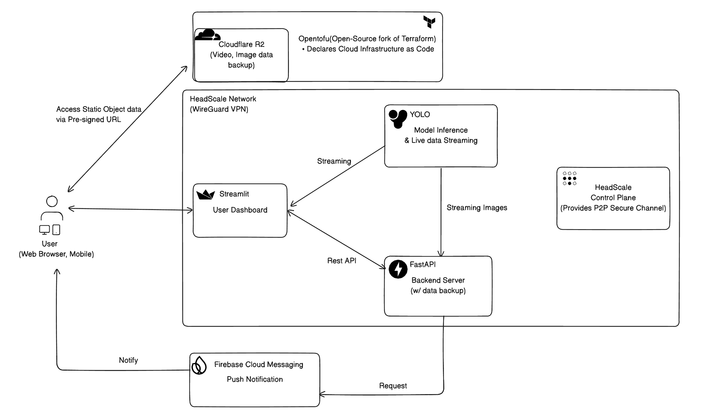

# FireDetector

2025-2 오픈소스SW의이해 기말프로젝트

> 단순 감지를 넘어, "진짜 화재"를 판단하는 지능형 파수꾼

기존 화재 감지기는 연기가 천장에 닿을 때까지 기다려야 했습니다.  
저희 서비스는 카메라가 **'눈'** 으로 불꽃을 감지하고, AI가 **'뇌'** 로 상황을 판단하여 즉시 알려줍니다.

## 👥 팀원 및 역할

| 학번     | 이름   | 역할                                        |
| -------- | ------ | ------------------------------------------- |
| 20215106 | 강채운 | 백업서버 구현, 클라우드 백업 인프라 IaC구축 |
| 20215203 | 이동혁 | Mobile APP 개발 및 구축                     |
| 20225123 | 김성호 | 모델 이벤트 로직 개발, 프론트엔드 개발      |
| 20225132 | 김인우 | LLM API 관리 및 참여                        |

## 🔥 주요 기능

- YOLO모델기반 화재 탐지
- Gemini API를 통한 2차 검증
- 실시간 대시보드 제공
- FCM을 통한 모바일 실시간 알림
- 화재 1차감지시점부터 영상을 별도 백업저장(로컬 및 클라우드) -> 추후 보험 자료 등에 사용 가능
- 오탐데이터 피드백 -> 추후 모델 보완에 사용

### 🎯 화재 감지 시스템으로서의 차별점

**"진짜 불인가요?" - YOLO + LLM 이중 검증**
단순히 빨간색을 불로 인식하는 기존 Vision AI의 한계를 LLM 검증으로 극복했습니다.

| 기존 방식 (YOLO Only)                                    | 2차 검증 (with LLM)                                      |
| -------------------------------------------------------- | -------------------------------------------------------- |
| 빨간 조명, 촛불, 요리 중인 가스불을 모두 '화재'로 오탐지 | 이미지의 맥락(Context)을 파악하여 위험한 상황인지 재확인 |
| "어? 불 같다! (신뢰도 70%)" → 오경보 발생                | AI Agent 분석 → 알림 보류 (안전)                         |

## ⚡️ 화재 이벤트 동작 로직

```plaintext
┌─────────────────┐
│  Start main.py  │
└────────┬────────┘
         ▼
┌─────────────────┐
│ Read Frame from │◄─────────────────────────────┐
│     Camera      │                              │
└────────┬────────┘                              │
         ▼                                       │
┌──────────────────┐                             │
│YOLO FireDetection│──── NO ─────────────────────┤
└────────┬─────────┘                             │
         │ YES                                   │
         ▼                                       │
┌─────────────────┐                              │
│ Fire Detected?  │ ──── NO ─────────────────────┤
└────────┬────────┘                              │
         │ YES                                   │
         ▼                                       │
┌─────────────────┐                              │
│ Draw Blue Box   │                              │
└────────┬────────┘                              │
         ▼                                       │
┌─────────────────┐         ┌─────────────────┐  │
│ New Fire Event? │── NO ──►│  Update Frame   │──┘
└────────┬────────┘         └─────────────────┘
         │ YES (이벤트 오류 방지용 2차 확인)
         ▼
┌─────────────────┐
│   Start Timer   │
└────────┬────────┘
         ▼
┌─────────────────┐
│ Timer Expired?  │── NO ──► (대기)
└────────┬────────┘
         │ YES
         ▼
┌─────────────────┐    ┌─────────────────┐
│  Confirm Fire   │───►│Run Gemini       │
└─────────────────┘    │Analysis         │
                       └────────┬────────┘
                                ▼
                       ┌─────────────────┐
                       │Log Gemini Result│
                       └────────┬────────┘
                                ▼
┌─────────────────┐    ┌─────────────────┐
│ Send to Frontend│◄───│  Socket Server  │◄── Encode Frame
└─────────────────┘    └────────┬────────┘
                                ▼
                       ┌─────────────────┐
                       │ Save In Server  │
                       └─────────────────┘
```

## 🏗️ 시스템 아키텍처



| 주요 구성 요소           | 설명                                                                                                                  |
| ------------------------ | --------------------------------------------------------------------------------------------------------------------- |
| 1. Edge Device           | 카메라 영상 캡처 및 YOLO Lite 화재 특화 모델로 1차 의심 상황 포착 (Target: Raspberry Pi 4) & Gemini 2차 검증          |
| 02. Backend Server       | FastAPI 기반. 블랙박스 영상 저장 & 피드백 루프 구축                                                                   |
| 03. User Client          | Android App (FCM 알림) & Web Dashboard (Streamlit 모니터링)                                                           |
| 04. Cloudflare R2 Bucket | 백업 및 오탐신고 비디오 저장 아카이브 및 Pre-signed URL을 통한 임시 오브젝트 개방, Egress 비용 0원의 비용 효율적 백업 |

> 현재 프로토타입은 PC 환경에서 개발되었으며, 추후 라즈베리파이로 포팅 가능한 구조로 설계되었습니다.

## 📁 폴더 구조

### Android

```bash
android
├── app                         # 실제 안드로이드 애플리케이션 모듈
│   ├── build.gradle.kts        # 앱 모듈 Gradle 설정
│   ├── proguard-rules.pro      # 릴리즈용 난독화 규칙
│   └── src
│       └── main
│           ├── AndroidManifest.xml   # 앱 진입점 및 권한 설정
│           ├── java/com/hallymUniv/fire_detector
│           │   ├── MainActivity.kt   # 앱 메인 액티비티
│           │
│           │   ├── data
│           │   │   └── UrlDataStore.kt
│           │   │       # 서버 API 주소 저장 (DataStore 기반 설정 관리)
│           │
│           │   ├── fcm
│           │   │   ├── FireFirebaseMessagingService.kt
│           │   │   │   # FCM 메시지 수신 서비스
│           │   │   └── NotificationUtil.kt
│           │   │       # 화재 알림(Notification) 생성 유틸
│           │
│           │   └── ui
│           │       ├── dashboard
│           │       │   └── DashboardScreen.kt
│           │       │       # 화재 감지 상태 대시보드 UI
│           │       │
│           │       ├── setup
│           │       │   └── UrlSetupScreen.kt
│           │       │       # 서버 주소 초기 설정 화면
│           │       │
│           │       ├── splash
│           │       │   └── SplashScreen.kt
│           │       │       # 앱 시작 시 스플래시 화면
│           │       │
│           │       ├── navigation
│           │       │   └── AppNavHost.kt
│           │       │       # Jetpack Compose Navigation 관리
│           │       │
│           │       ├── icons
│           │       │   └── Fire.kt
│           │       │       # 커스텀 아이콘 정의
│           │       │
│           │       └── theme
│           │           ├── Color.kt
│           │           ├── Theme.kt
│           │           └── Type.kt
│           │               # 앱 공통 테마 및 디자인 시스템
│           │
│           └── res
│               ├── values        # 색상, 문자열, 테마 리소스
│               ├── drawable      # 아이콘 및 이미지 리소스
│               ├── mipmap-*      # 앱 런처 아이콘
│               └── xml
│                   ├── backup_rules.xml
│                   └── data_extraction_rules.xml
│
├── gradle                      # Gradle Wrapper 관련 파일
├── build.gradle.kts            # 프로젝트 전체 Gradle 설정
├── settings.gradle.kts         # 멀티 모듈 구성 설정
├── gradlew / gradlew.bat       # Gradle 실행 스크립트
├── gradle.properties           # Gradle 공통 옵션
├── local.properties            # 로컬 SDK 경로 (환경 의존)
│
├── .gradle/                    #  Gradle 캐시 (원래 gitignore 대상)
├── .idea/                      #  Android Studio 설정 파일
└── build/                      #  빌드 결과물
```

### Backup Server

```bash
backup-server
├── .env                    # 환경 변수 (git 추적 제외)
├── .venv                   # 가상 환경 (git 추적 제외)
├── serviceAccountKey.json  # FCM serviceAccount (git 추적 제외)
├── main.py                 # 애플리케이션 진입점
├── requirements.txt        # 의존성 목록
└── src
    ├── api                 # REST API 및 Websocket 핸들러
    │   └── v1              # API v1
    ├── backup              # 백업 워커 프로세스 로직
    ├── core                # 프로젝트 설정 (config, logger 설정 등)
    ├── db                  # DB 연결 설정 (BaseModel, engine 등)
    │   └── models          # DB 모델 설정
    ├── middleware          # 미들웨어
    ├── repository          # 데이터 접근 계층
    ├── schemas             # Pydantic 스키마 - 요청 및 응답 json body 매핑
    └── services            # 주요 비즈니스 로직 처리
```

### Cloud Backup

```bash
cloud-backup
├── blackbox_bucket.tf          # 백업데이터 저장소 버킷 정의
├── fp_bucket.tf                # 오탐데이터 저장소 버킷 정의
├── main.tf                     # Provider 선언 및 API 연결 설정
├── terraform.tfstate           # tfstate: 현재의 terraform 상태 (git 추적 제외)
├── terraform.tfstate.backup    # tfstate의 이전 상태 (git 추적 제외)
├── terraform.tfvars            # 변수 값 정의
└── variables.tf                # 변수 선언
```

### Model

```bash
model_develop
├── fireModel
│   ├── best.pt                # 화재 감지용 YOLOv8 커스텀 학습 모델 (최종)
│   └── yolov8s.pt             # YOLOv8s 기본 사전학습 모델
│
├── main.py                    # 전체 화재 감지 파이프라인 메인 실행 파일
├── gemini_analyzer.py         # Gemini Vision API 기반 2차 화재 검증 로직
├── gemini_vision_example.py   # Gemini Vision API 테스트 및 예제 코드
│
├── fire_events.json           # 화재 감지 이벤트 로그 (timestamp, confidence 등)
├── animal_events.json         # 동물 감지 이벤트 로그 (오탐 분석용)
├── gemini_analysis_log.txt    # Gemini 분석 결과 텍스트 로그
│
├── requirements.txt           # 모델 실행에 필요한 Python 의존성 목록
└── test.jpg                   # Gemini Vision 및 모델 테스트용 샘플 이미지
```

### Frontend

```bash
frontend
├── .env                            # 환경 변수 (git 추적 제외)
├── .venv                           # 가상 환경 (git 추적 제외)
├── app.py                          # 메인 진입점
├── helpers.py                      # 모델 <-> 대시보드 소켓 통신 클라이언트 로직
├── pages
│   ├── 0_📊_Dashboard.py           # 주요 대시보드 페이지
│   ├── 2_📷_Camera.py              # 카메라 페이지
│   ├── 3_⚙️_Settings.py            # 환경설정
│   └── 4_🎬_BackupVideo.py         # 백업 / 오탐 비디오 조회 페이지
└── requirements.txt                # 의존성
```

## 🚀 Setup

- [Cloudflare R2 셋업 가이드](docs/setup-r2.md)
- [백업 서버 셋업 가이드](docs/setup-backup-server.md)
- [HeadScale 세팅 가이드](docs/setup-headscale.md)
- [Streamlit 세팅 가이드](docs/setup-streamlit.md)
- [YOLO 모델 세팅 가이드](docs/setup-main.md)
- [FCM 세팅 가이드](docs/setup-fcm.md)

## 👨‍⚖️ License

이 프로젝트는 AGPL-3.0라이선스를 따릅니다.

주요 의존성:

| 이름                                                                       | 라이선스           | 비고                                           |
| -------------------------------------------------------------------------- | ------------------ | ---------------------------------------------- |
| [Streamlit](https://github.com/streamlit/streamlit/tree/develop)           | Apache-2.0 License |                                                |
| [FastAPI](https://github.com/fastapi/fastapi)                              | MIT License        |                                                |
| [SQLAlchemy](https://github.com/sqlalchemy/sqlalchemy)                     | MIT License        |                                                |
| [SQLite](https://sqlite.org/purchase/license)                              | Public Domain      |                                                |
| [Numpy](https://github.com/numpy/numpy)                                    | BSD 3-Clause       |                                                |
| [Boto3(AWS SDK)](https://github.com/boto/boto3)                            | Apache-2.0 License |                                                |
| [OpenCV](https://github.com/opencv/opencv)                                 | Apache-2.0 License |                                                |
| [YOLOv8](https://github.com/ultralytics/ultralytics)                       | AGPL-3.0 License   |                                                |
| [FFmpeg](https://github.com/FFmpeg/FFmpeg)                                 | LGPL/GPL           | 서브프로세스로 실행하므로 아무 상관 없음       |
| [Opentofu](https://github.com/opentofu/opentofu)                           | MPL 2.0 License    | HCL문법 사용 & Opentofu 실행에는 아무 상관없음 |
| [Fire Icon](https://composables.com/icons/icon-libraries/heroicons/fire)   | MIT License        | Android Client 개발에 사용된 불 아이콘 코드    |
| [firebase-android-sdk](https://github.com/firebase/firebase-android-sdk)   | Apache-2.0 License |                                                |
| [firebase-admin-python](https://github.com/firebase/firebase-admin-python) | Apache-2.0 License |                                                |
| [androidx](https://github.com/androidx/androidx)                           | Apache-2.0 License |                                                |

## 📜 기타 문서

- [API명세서](docs/backup-api.md)
