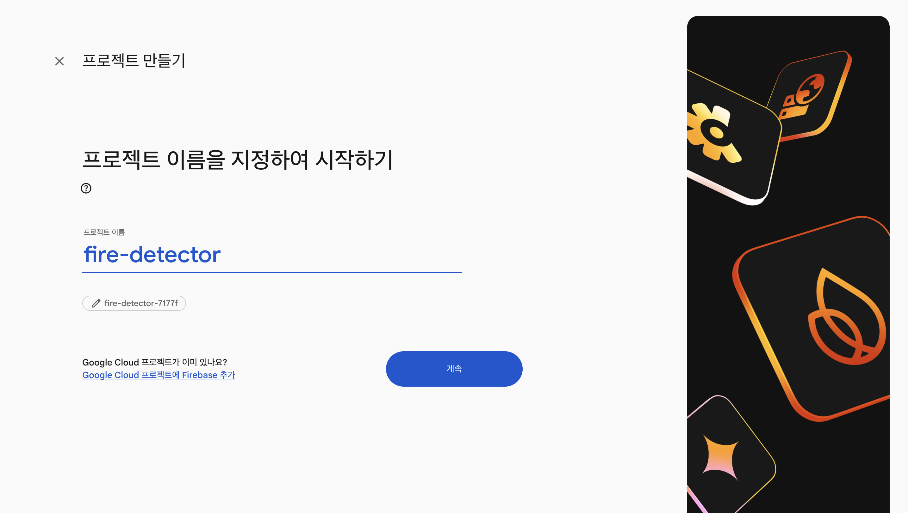
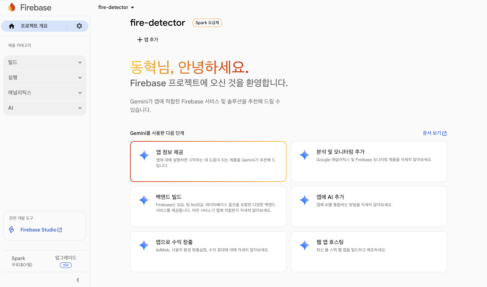
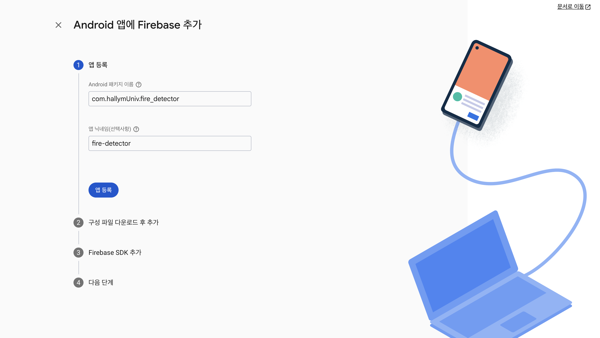
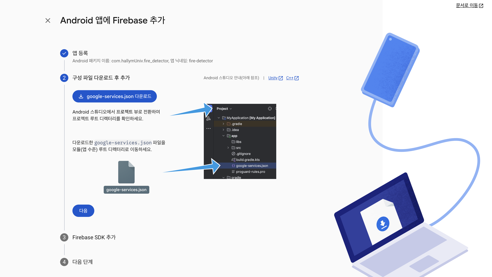
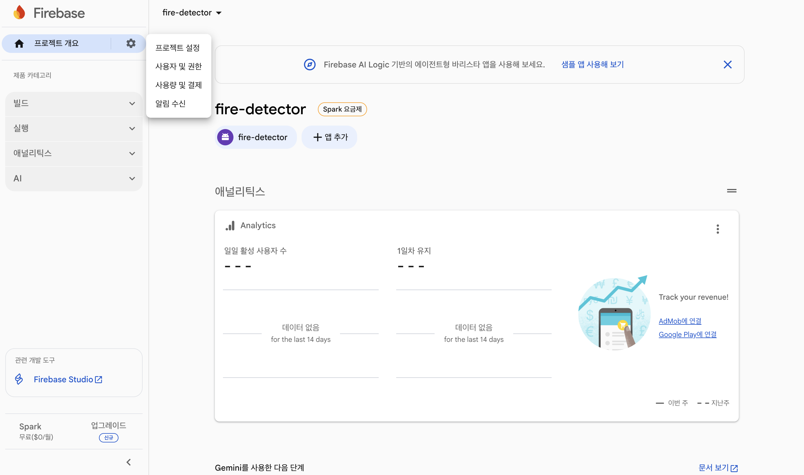
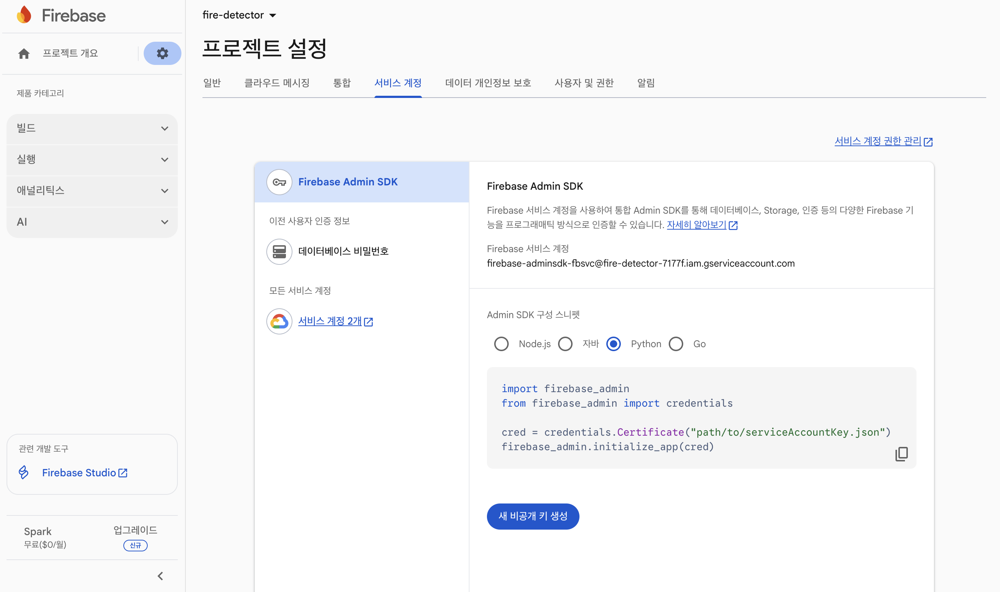

# FCM 세팅 가이드

이 문서는 FCM 세팅 가이드를 제공합니다.

**FCM**은 Firebase Cloud Messaging의 약자로, 구글이 제공하는 무료 **크로스 플랫폼 메시징 서비스**이며, 서버에서 안드로이드, iOS, 웹 클라이언트 앱으로 푸시 알림 및 데이터를 안정적으로 보내는 솔루션입니다. 앱 사용자에게 새로운 소식, 이벤트 알림 등을 보내 재참여를 유도하고, 데이터 동기화 및 다양한 메시지 타겟팅 기능을 통해 앱 사용자 경험을 향상시키는 데 사용됩니다.

## 참고 자료 & 안내

- [Android 프로젝트에 Firebase 추가](https://firebase.google.com/docs/android/setup?hl=ko)
- [서버에 Firebase Admin SDK 추가](https://firebase.google.com/docs/admin/setup?hl=ko)

세팅 방법에 변동이 생길 수도 있으니 공식 문서의 링크를 같이 첨부합니다.

본 문서에서는 사용자가 직접 세팅해야하는 부분에 대해서만 가이드를 제공합니다.

그 외의 패키지 설치, 코드 추가 같은 세팅은 이미 다 되어있는 상태입니다.

## Android 세팅 (google-services.json 다운로드)

1. [Firebase Console](https://console.firebase.google.com/)에 접속 후 로그인합니다.

2. [새 Firebase 프로젝트 만들기]를 클릭해 프로젝트를 만듭니다. 프로젝트 이름은 자유롭게 작성하고 기본 값들을 그대로 두고 계속 다음으로 넘어가면 됩니다.

3. [앱 추가]를 클릭한 후 [Android]를 선택합니다.

4. 앱을 등록합니다. 패키지 이름은 사진과 동일하게 `com.hallymUniv.fire_detector`를 작성합니다.

5. [앱 등록] 클릭 후 다음으로 넘어가 `google-services.json`을 다운해 `android/app` 에 위치시킵니다.

6. 계속 다음으로 넘어가 프로젝트 생성을 마무리합니다.

## 서버 세팅 (serviceAccountKey.json 다운로드)

1. [Firebase Console](https://console.firebase.google.com/)에 접속 후 생성한 프로젝트에 들어갑니다. 그리고 [프로젝트 설정]을 클릭합니다.

2. [서비스 계정] 탭으로 넘어가 [Python]을 체크 후 [새 비공개 키 생성]을 클릭해 파일을 다운 받습니다.

3. 다운받은 파일의 이름을 `serviceAccountKey.json`으로 변경 후 `backup-server` 디렉터리에 위치시킵니다.
