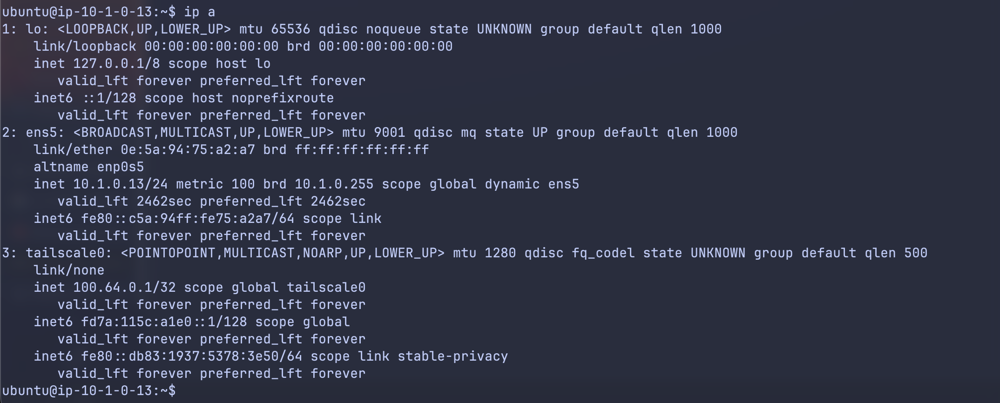
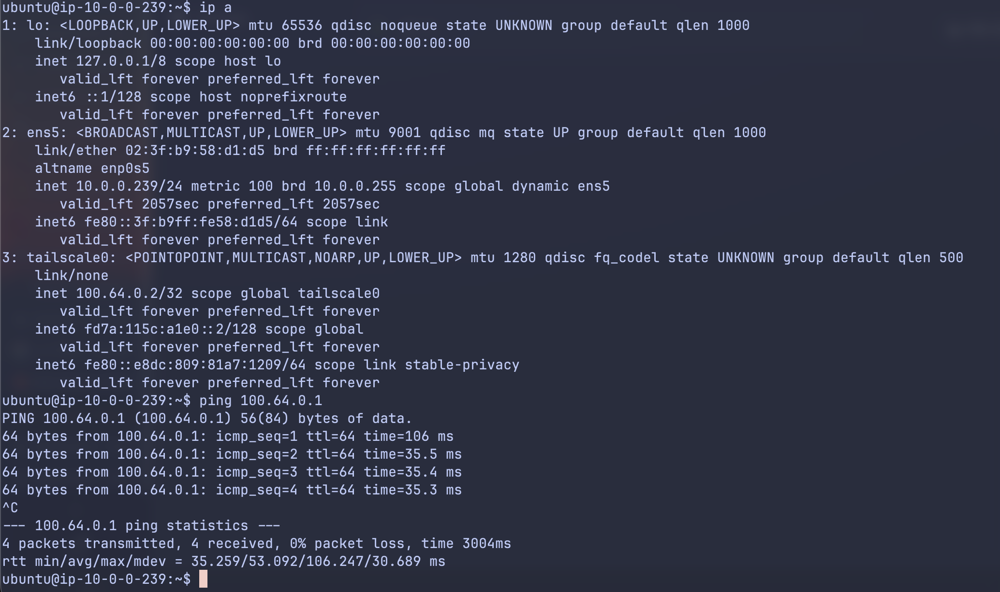

# Headscale VPN 호스팅하기

**Headscale은 Tailscale의 셀프 호스트 버전**으로, Wireguard VPN을 쉽게 구성할 수 있도록 제공합니다.    
WireGuard는 컴퓨터, VM, 컨테이너들(WireGuard에서는 “endpoint"라고 하고, TailScale에서는 “node"라고 부름)간의, 네트워크 밖의 다른 노드들과 경량의 암호화 터널을 만들어줍니다.    

WireGuard는 기존 IPSec, OpenVPN보다 더 단순한 구조로 간단하면서, 강력하고, 성능이 좋습니다.    
전통적인 VPN들이 수만 줄로 구현되어있는 반면, 약 4천 줄의 코드로 구현되어있습니다.    
2017년 Jason A. Donefeld가 백서를 공개했습니다.    
최신 암호 프리미티브들을 사용합니다: 
- 암호화: ChaCha20
- 메시지 인증: Poly1305
- 키 교환: Curve25519
- 해시: BLAKE2s
- 키 파생: HKDF

WireGuard 터널을 통해, IP패킷 전체를 암호화하여 UDP패킷의 페이로드에 담고, new IP Header를 만들어서 네트워크에 보냅니다.    

TailScale은 Control Plane과 Data Plane으로 나뉘어 동작하며, Control Plane은 각 노드들의 공개 키 레포지토리 + NAT Traversal 중개(NAT와 방화벽뒤에 보호받는 노드들의 터널 생성) + ACL(Access Control List), DERP fallback(P2P터널 생성 실패 시, 트래픽 중개)의 역할을 맡습니다.  

## 요구사항
Control Plane의 요구사항은 다음과 같습니다:
- 리눅스/BSD기반 운영체제
- Public IP주소(Port forwarding으로 노출되어도 가능)
- 도메인 + HTTPS

## 참고 자료
Headscale을 셀프호스트 하는데에는 리버스 프록시 구성, Let's Encrypt 연동 등의 번거로운 작업이 동반됩니다.    
대신, [serversathome의 가이드](https://wiki.serversatho.me/en/headscale)는 쉬운 설치 가이드를 제공합니다.   

위 가이드의 Control Plane Node에서는 Docker가 필요한데, 위 페이지에서는 제공되지 않습니다.    
대신, [여기](https://docs.docker.com/engine/install/)를 참조하십시오.    

또한, 위 가이드에서는 Tailscale 클라이언트의 설치 가이드는 제공되지 않습니다.
대신, [여기](https://tailscale.com/kb/1031/install-linux)를 참조하십시오.  

## 연결 성공 시
노드들이 잘 연결되었다면, 서로 다른 네트워크에 있는 두 노드가 각각 특수한 대역의 IP(`100.x.y.z`, [RFC 6598 - Shared Address Space](https://datatracker.ietf.org/doc/html/rfc6598))를 할당받고, 마치 서로 같은 네트워크에 있는 것처럼 통신할 수 있습니다.  

아래 예시에서는 서로 다른 VPC(Virtual Private Cloud)에 있는 AWS EC2 인스턴스가 서로 `ping`을 주고받는 것을 볼 수 있습니다.

