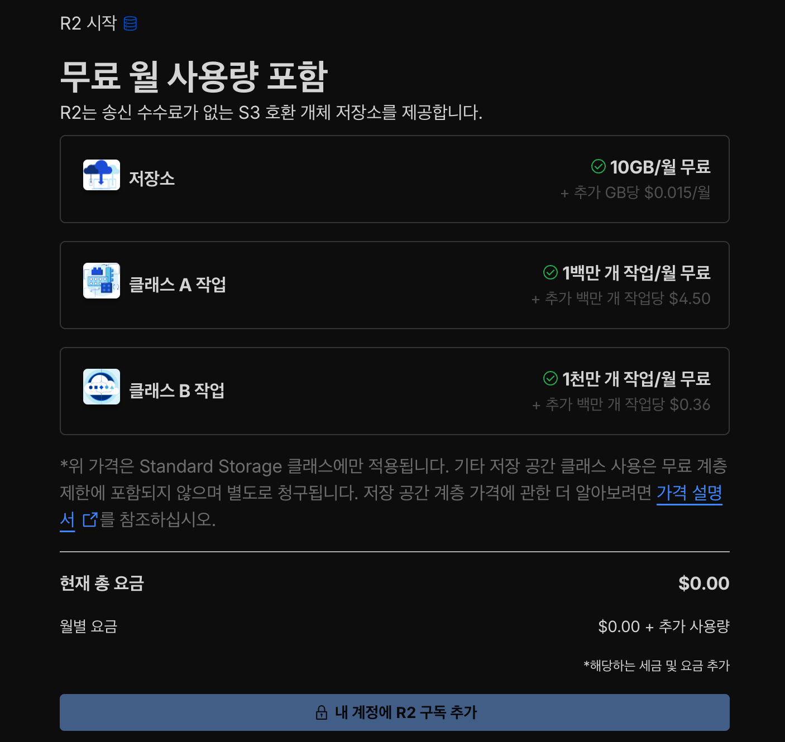
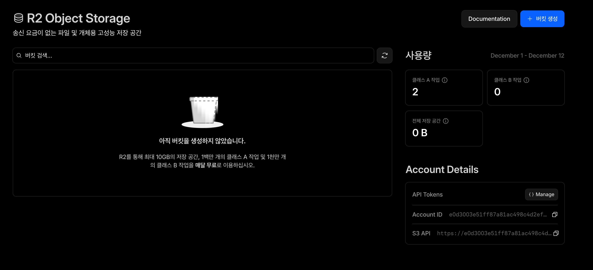
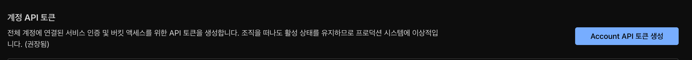
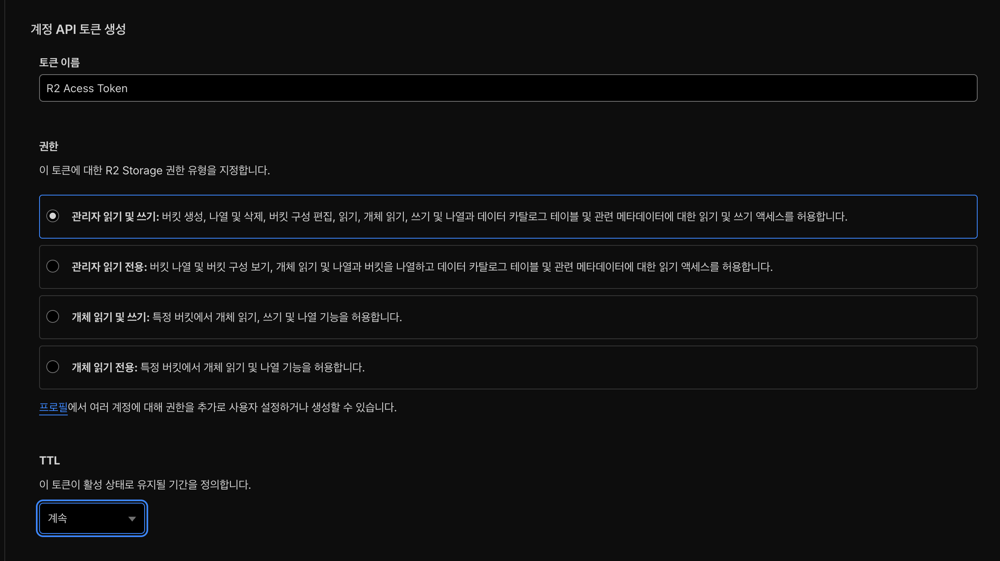
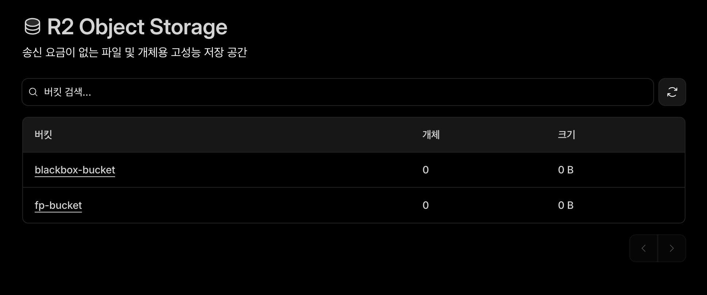
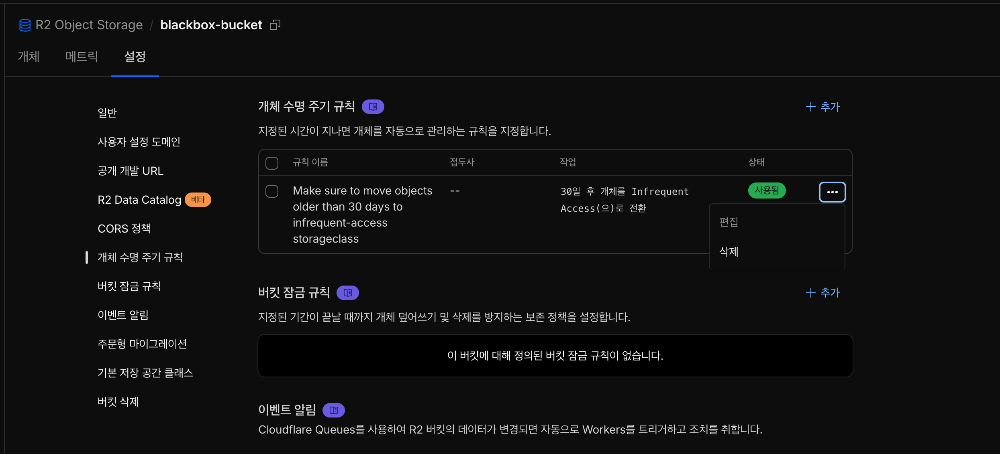

# Cloudflare R2 세팅 가이드

Cloudflare R2는 고가용성의 클라우드 오브젝트 스토리지로, 비정형 데이터 및 정적 파일들에 대해 비용 효율적이며 고성능으로 저장할 수 있습니다.  
다음의 특장점을 가집니다: 
- 널널한 프리티어
- 매우 빠른 성능
- 9-nines의 내구성(99.9999999%)
- Standard기준, 타 CSP의 오브젝트 스토리지들보다 저렴
- **Egress비용 0원**
- AWS S3 호환 API 사용

## Cloudflare R2 구독하기
[Cloudflare 대시보드](dash.cloudflare.com)에 접속해서, [스토리지 및 데이터베이스] -> [R2 Object Storage]에 들어갑니다.  
R2 구독을 추가해줍니다.  



## API 토큰 발급

R2 대시보드에서, [Account Details]에서 [API Tokens] 옆의 [Manage]를 누릅니다.


[Account API 토큰 생성]을 누릅니다.


토큰의 이름을 정하고, 권한은 **관리자 읽기 및 쓰기**로 지정합니다.


이렇게 생성된 API Token을 안전한 저장소에 보관하도록 합니다.  

## OpenTofu 설치
**OpenTofu는 HashiCorp Terraform의 오픈 소스 포크인 IaC(Infrastructure-as-Code)도구** 입니다.  
**HCL(HashiCorp Configuration Language)** 라는 DSL(Domain Specific Language)를 사용하여 인프라 자원을 코드로 구축하여 재현성을 높여줍니다.  
[여기](https://opentofu.org/docs/intro/install/)에서 OpenTofu를 설치하십시오.

권장 버전은 v1.11.1 입니다.

## `terraform.tfvars` 구성

`terraform.tfvars`는 변수를 주입할 때 사용하는 특별한 파일입니다.    
여기에 API 키와 Cloudflare Account ID를 넣어줄 것입니다.   

```bash
cd cloud-backup
cp terraform.tfvars.example terraform.tfvars
```

이후, `cloudflare_api_token`에 이전에 발급한 API Token값을, `account_id`에 Cloudflare Account ID를 따옴표(`""`)로 감싸 지정합니다.   
Cloudflare Account ID는 대시보드에서 복사할 수 있습니다.  
추가로, 백업 버킷과 오탐데이터 버킷의 이름도 마음대로 바꿀 수 있습니다.

## 실행하여 자원 생성

아래의 명령어들을 실행합니다.
```bash
tofu init # 필요한 의존성 및 provider 설치
tofu plan # 실행 계획 보기(문법 체크 및 결과 예상)
tofu apply # 클라우드 자원을 현재 선언대로 동기화 -auto-approve 옵션으로 자동 승인
```

실행 후, 버킷들이 생성되었습니다!


## 자원 정리하기

현재 Cloudflare Provider가 R2 수명 주기 규칙에 대한 자동 정리를 지원해주지 않기에, 이 부분에 대해서는 수동 정리가 필요합니다.

각 버킷에 대해서, [설정] -> [개체 수명 주기 규칙] -> [삭제]를 진행하면 됩니다.


이후, 나머지는 아래 명령으로 제거하면 됩니다.

```bash
tofu destroy # 선언된 자원 제거. -auto-approve 옵션으로 자동 승인
```
